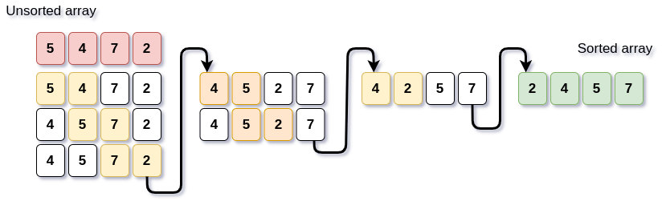

# Algorithms

<!-- TOC -->

- [Algorithms](#algorithms)
    - [Bases](#bases)
        - [What even is algorithm?](#what-even-is-algorithm)
        - [Why is it needed?](#why-is-it-needed)
    - [Sorting](#sorting)
        - [Bubble sort](#bubble-sort)

<!-- /TOC -->

## Bases

### What even is algorithm?

Algorithm is a set of instructions. It's created in a way, that no matter circumstances you can use it.

Basically you can have a simple description of _how you can do something_ and you can implement it in different languages etc.

### Why is it needed?

Let's consider this example:

_We want to add 100 to existing number._

We can do that in two ways:
```cpp
x = x + 100;
```
or 
```cpp
for(int i = 0; i < 100; i++)
    x = x + 1;
```
What do you think is going to be faster? One operation of increasing it by 100 or 100 times increasing it by one?

Yes, algorithms are trying to find the most efficient and easiest way of doing stuff.


## Sorting

There are some different types of sorting algorithms.

### Bubble sort

One of the slow sorting algorithms.
It compares every pair until it had reached the end.
It can be optimized by not comparing the last sorted pairs.

This is basically how it would look like:



My C++ implementation of it:
```cpp
for(int i = 0; i < size-1; i++)
{
    for(int j = 0; j < size-i-1; j++) //i elements are already sorted at the end
        if(array[j] > array[j+1]) //if next is bigger swap them
        {
            int t = array[j];
            array[j] = array[j+1];
            array[j+1] = t;
        }
}
```
where `size` is the size of array and `array` is the array we want to sort

Complexity:
 - worst case = **O(n*n)** 
 - avg case = **O(n log n)** 

