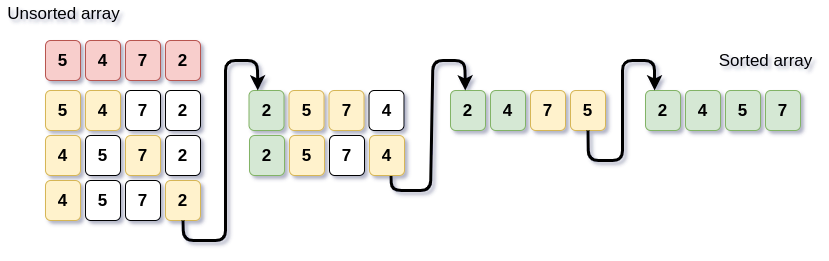

<!--  -->

# Algorithms

<!-- TOC -->

- [Algorithms](#algorithms)
	- [Bases](#bases)
		- [What even is algorithm?](#what-even-is-algorithm)
		- [Why is it needed?](#why-is-it-needed)
	- [Greatest common divisor](#greatest-common-divisor)
		- [Extended Euclidean algorithm](#extended-euclidean-algorithm)
		- [Modular multiplicative inverse](#modular-multiplicative-inverse)
		- [Least common multiple](#least-common-multiple)
	- [Recursive vs iterative](#recursive-vs-iterative)
	- [Exponentiation by squaring](#exponentiation-by-squaring)
	- [Primality test](#primality-test)
		- [Checking the divisibility](#checking-the-divisibility)
		- [Eratosthenes Sieve](#eratosthenes-sieve)
		- [Linear Sieve](#linear-sieve)
	- [Sorting](#sorting)
		- [Bubble sort](#bubble-sort)
		- [Selection sort](#selection-sort)
	- [Prefix sum](#prefix-sum)

<!-- /TOC -->

## Bases

### What even is algorithm?

Algorithm is a set of instructions. It's created in a way, that no matter circumstances you can use it.

Basically you can have a simple description of _how you can do something_ and you can implement it in different languages etc.

### Why is it needed?

Let's consider this example:

_We want to add 100 to existing number._

We can do that in two ways:

```cpp
x = x + 100;
```

or

```cpp
for(int i = 0; i < 100; i++)
    x = x + 1;
```

What do you think is going to be faster? One operation of increasing it by 100 or 100 times increasing it by one?

Yes, algorithms are trying to find the most efficient and easiest way of doing stuff.

## Greatest common divisor

This is also called Euclidean algorithm.

Simple algorithm that can easily find greatest common divisor.
My c++ implementation:

```cpp
while(a != b)
{
    if (a > b)
        a = a - b;
    else
        b = b - a;
}
int gcd = a; //GCD of a and b
```

It's inefficient tho.
Better version of it would be:

```cpp
while(b)
{
    int temp = b;
    b = a % b;
    a = temp;
}
int gcd = a; //GCD of a and b
```

for different inputs

```
gcd(15, 10) = 5
gcd(11, 10) = 1
gcd(20, 30) = 10
```

You can also do recursive:

```cpp
int gcd(int a, int b)
{
    if(a) return gcd(b%a, a);
    return b;
}
```

### Extended Euclidean algorithm

It's just extended GCD by coefficients of Bezout identity(x, y).

This is the math representation:
**ax + by = gcd(a,b)**

C++ implementation:

```cpp
int x = 0, x1 = 1;
int y = 1, y1 = 0;

while(b != 0)
{
    int q = a/b;
    int temp = b;
    b = a % b;
    a = temp;
    temp = x;
    x = x1 - q * x;
    x1 = temp;
    temp = y;
    y = y1 - q * y;
    y1 = temp;
}
x = x1;
y = y1;
```

### Modular multiplicative inverse

**a \* x ≡ 1 mod m**

We're looking for this **x**

Funny thing is that it does not always exist. It exists when _a_ and _m_ are coprime. _gcm(a, m) = 1_
To get this _x_ what we can do is we can just use famous **Extended Euclidean algorithm**

Like I said above this is how it looks:
**ax + by = gcd(a,b)**
Now we can replace this `gcd` with `1` because they have to be coprime.
**ax + my = 1**
Now we can do `modulo m` for both sides:
**ax ≡ 1 mod m**

so If i had a c++ function `ext_euclidean`:

```cpp
int ext_euclidean(int a, int b, int &x, int &y)
{
    x = 0;
    y = 1; //init value for referenced ints

    int y1 = 0, x1 = 1; //additional vars

    while(b != 0)
    {
    	int q = a/b;
    	int temp = b;
    	b = a % b;
    	a = temp;
    	temp = x;
    	x = x1 - q * x;
    	x1 = temp;
    	temp = y;
    	y = y1 - q * y;
    	y1 = temp;
    }
    x = x1;
    y = y1;
    return a;
}
```

We could calculate `x` by doing:

```cpp
int x,y;
int a = 11, m = 17; //some example numbers you can change them
if(ext_euclidean(a, m, x, y) == 1)
    x = (x%m+m)%m;
```

So our `mod_mul_inv` could look like this:

```cpp
int mod_mul_inv(int a, int m)
{
    int x = 0, y = 1, b = m;
    int y1 = 0, x1 = 1;

    while(b != 0)
    {
    	int q = a/b;
    	int temp = b;
    	b = a % b;
    	a = temp;
    	temp = x;
    	x = x1 - q * x;
    	x1 = temp;
    	temp = y;
    	y = y1 - q * y;
    	y1 = temp;
    }
    x = x1;
    y = y1;
    if(a == 1) //they have to be coprime
        return (x%m+m)%m;

    else
       throw "They're not coprime lol";
    return -1;
}
```

Let's check this functions for a few sample inputs:

```cpp
cout << mod_mul_inv(11, 17) << "\n";
cout << mod_mul_inv(113, 127) << "\n";
cout << mod_mul_inv(23, 29) << "\n";
```

The output would be:

```
14
9
24
```

And IT'S CORRECT!

It's correct because **1 = (11 \* 14) mod 17**

### Least common multiple

The formula for it looks like this:

**lcm(a, b) = |a\*b|/gcd(a,b)**

so the easiest implementation would be:

```cpp
int top = (a*b >= 0) ? a*b : a*b*(-1); //ternary for making negative positive (just in case)
while(b)
{
    int temp = b;
    b = a % b;
    a = temp;
}
int gcd = a;
int lcm = top/gcd;
```

## Recursive vs iterative

I have no idea why people do not understand it.
Recursion is simply what happens when you invoke a function that invokes itself.
Iterative approach would be when you'd go one by one.

If you don't understand it yet I'll give some examples.

This js function in iterative:

```js
function first(n) {
  var outcome = 1;
  for (
    var i = 1;
    i <= n;
    i++ //iterative part
  ) {
    outcome = outcome * i;
  }
  return outcome;
}
```

It's iterative because it iterates through something.

The same but recursive function would look like this:

```js
function second(n) {
  if (n == 0 || n == 1) return 1;
  else return second(n - 1) * n; //recursive part
}
```

This function return the return of invoking itself for smaller arguments;

For example if you'd feed this function number 6 as a argument then this is how it would be invoked;

Because: `second(x) = [if x is equal to 0 or 1] (1) [otherwise] (second(x-1)*x)`

```
user -> second(6)
       = second(6-1)*6
       = second(5)*6
       = second(5-1)*5*6
       = second(4)*5*6
       = second(4-1)*4*5*6
       = second(3)*4*5*6
       = second(3-1)*3*4*5*6
       = second(2)*3*4*5*6
       = second(2-1)*2*3*4*5*6
       = second(1)*2*3*4*5*6
       = 1*2*3*4*5*6
       = 720
```
Recursion is not the best solution for most problems.
One of it's faults is a problem with to too big recursion depth


## Exponentiation by squaring

We want to efficiently solve this: **17<sup>12</sup>**

First, lets consider this example.

**3<sup>23</sup> = 3<sup>10111<sub>2</sub></sup> = 3<sup>16</sup> _ 3<sup>4</sup> _ 3<sup>2</sup> \* 3<sup>1</sup>**

That's because for every single bit is a power of two:

```
1 = 1
10 = 2
100 = 4
1000 = 8
10000 = 16
```

So if we have:

```
101010 = 10 + 1000 + 100000 = 2 + 8 + 32
```

Because each element is a square of the previous one we can easily count it.

3<sup>1</sup> = 3

3<sup>2</sup> = 9

3<sup>4</sup> = (3<sup>2</sup>)<sup>2</sup> = 81

3<sup>8</sup> = (3<sup>4</sup>)<sup>2</sup> = 81<sup>2</sup> = 6561

We need to later multiply every single of those powers that those binary notation "uses"

If we had to do 3<sup>1011<sub>2</sub></sup> then it would be `result = 3 * 9 * 6561`

This is my implementation of this binary exponentiation.

```cpp
long rlen_pow(long base, int exponent)
{
	long result = 1;
	while(exponent > 0)
	{
		if(exponent & 1) //check the last bit of exponent if it's set
		{
			result *= base; //result should be now multiplied by the corresponding power for a specific bit
		}
		base *= base; //make the base a bigger power
		exponent >>= 1; //shift bitwise to right to make the penultimate bit the last bit to later check it
	}
	return result;
}
```

Complexity

- **O(log n)**

## Primality test

We have a few ways to check if a number is prime or to get a set of primes.

### Checking the divisibility

To check if number **n** is prime we can check if this number is divisible by every number from **2** to **n/2**

That's my implementation of this algorithm:

```cpp
bool check_if_prime(int x)
{
    for (int i = 2; i < (x / 2); i++) //the biggest divisor of a number is number/2
    {
        if (x % i == 0)
        {
            return false; //if divisor found then theres no need to continue checking
        }
    }
    return true;
}
```

### Eratosthenes Sieve

Every singe number that is not a prime is a multiplied version of a prime.
Eg. 14 = 2 \* 7

Now, if we had an array of booleans set to `true` we could eliminate every multiplication of prime by setting all the indexes of non-primes to false. That can be done by just looking for every single multiplication of a number until we reach its square (for 2 it would be 4 and for 7 it would be 49)

This is basically how it would look like in c++.

```cpp
void eratosthenes_sieve(int size)
{
    bool numbers[size + 1]; //arrays start counting from 0
    for(bool& number : numbers) //set all the numbers to true first
        number = true;

    numbers[0] = false; //not a prime
    numbers[1] = false; //not a prime

    for(int i = 2; i <= size; i++) //going through all of them
    {
        if(numbers[i]) //if prime
        {
            for(int j = i + i; j <= size; j += i) //all the multiplications of a prime are not prime
            {
                numbers[j] = false;
            }
        }
    }

    for(int i = 0; i <= size; i++) //printing all the true indexes (they are primes)
    {
        if(numbers[i]) cout << i << "\t";
    }
}
```

So if we used this function with a bit of driver code:

```cpp
int main()
{
    eratosthenes_sieve(20);
    std::cout << "\n";
    return 0;
}
```

the output should be:

```txt
2       3       5       7       11      13      17       19
```

Complexity

- **O(n log log n)**

### Linear Sieve

It's called linear sieve because it works in a O(n) complexity (and that's linear complexity).

## Sorting

There are some different types of sorting algorithms.

### Bubble sort

One of the slow sorting algorithms.
It compares every pair until it had reached the end.
It can be optimized by not comparing the last sorted pairs.

This is basically how it would look like:


My C++ implementation of it:

```cpp
for(int i = 0; i < size-1; i++)
{
    for(int j = 0; j < size-i-1; j++) //i elements are already sorted at the end
        if(array[j] > array[j+1]) //if next is bigger swap them
        {
            int t = array[j];
            array[j] = array[j+1];
            array[j+1] = t;
        }
}
```

where `size` is the size of array and `array` is the array we want to sort

Complexity:

- worst case = **O(n\*n)**
- avg case = **O(n log n)**

### Selection sort



Basically you are looking for the smallest number in here. After that you replace the starting number with it.

This is my c++ implementation example:

```cpp
int smallest_index;
for(int i = 0; i < size-1; i++)
{
    smallest_index = i;
    for(int j = i+1; j < size; j++)
    {
        if(array[smallest_index] > array[j])
            smallest_index = j; //get index of the smallest elements of unsorted part
    }
    int t = array[i]; //replace them
    array[i] = array[smallest_index];
    array[smallest_index] = t;
}
```

Complexity: **O(n\*n)**

## Prefix sum

Let's consider this example:

You have a row matrix made out of 100000 elements. You need to 199999999999 times print a sum out of every singe elements between `a` and `b`.

We could sum them that way:

```cpp
for(int i = a; i < b; i++)
    sum += array[i];
```

The problem is that if the `a` would be `0` and `b` would be equal `10000` then we would have to do `100000*199999999999` operations that's because we would be summing those 100000 elements 199999999999 times.

You can say: **Why cant you just sum them once and then print them out this many times?**
Yeah, that's smart bro. But what if a and b would be changing?

That's where prefix sums comes in ;)

All you need to do is to create a second array containing the previously summed prefixes.
for example:

```
Array of numbers:
[1][5][6][3][6][8][1][2]

Array of sum of prefixes
[1][6][12][15][21][29][30][32]
```

So we would have to do 10000 operations at the start but when we would later need to get a sum from the first to the fifth element then we would just need to get one from array and we would save 4 additional operations.

You might be asking yourself:

_What if this `a` is bigger than 0?_

You can then get a sum from _`0` to `b`_ and subtract a sum _from `0` to `a`_ from it

So if we needed a sum from the third element to the seventh element then we would get a seventh prefix sum (that being 30) and subtract the third prefix sum from it (that being 12).
So our final sum would be **30 - 12 = 18** (yeah, you just did 2 instead of 5 operations)

That should work with n-dimensional arrays as well (but with a little bit of changes)

<!--  -->
