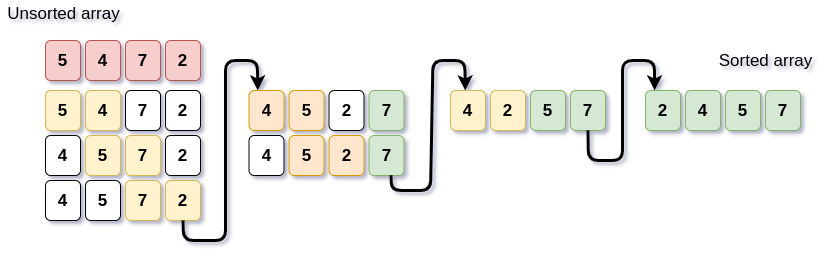

# Algorithms

<!-- TOC -->

- [Algorithms](#algorithms)
	- [Bases](#bases)
		- [What even is algorithm?](#what-even-is-algorithm)
		- [Why is it needed?](#why-is-it-needed)
	- [Greatest common divisor](#greatest-common-divisor)
		- [Extended Euclidean algorithm](#extended-euclidean-algorithm)
	- [Exponentiation by squaring](#exponentiation-by-squaring)
	- [Primality test](#primality-test)
		- [Checking the divisibility](#checking-the-divisibility)
		- [Eratosthenes Sieve](#eratosthenes-sieve)
		- [Linear Sieve](#linear-sieve)
	- [Sorting](#sorting)
		- [Bubble sort](#bubble-sort)

<!-- /TOC -->

## Bases

### What even is algorithm?

Algorithm is a set of instructions. It's created in a way, that no matter circumstances you can use it.

Basically you can have a simple description of _how you can do something_ and you can implement it in different languages etc.

### Why is it needed?

Let's consider this example:

_We want to add 100 to existing number._

We can do that in two ways:
```cpp
x = x + 100;
```
or 
```cpp
for(int i = 0; i < 100; i++)
    x = x + 1;
```
What do you think is going to be faster? One operation of increasing it by 100 or 100 times increasing it by one?

Yes, algorithms are trying to find the most efficient and easiest way of doing stuff.

## Greatest common divisor

This is also called Euclidean algorithm.

Simple algorithm that can easily find greatest common divisor.
My c++ implementation:
```cpp
while(a != b)
{
    if (a > b)
        a = a - b;
    else 
        b = b - a;
}
int gcd = a; //GCD of a and b
```
It's inefficient tho.
Better version of it would be:
```cpp
while(b)
{
    int temp = b;
    b = a % b;
    a = temp;
}
int gcd = a; //GCD of a and b
```
### Extended Euclidean algorithm

It's just extended GCD by coefficients of Bezout identity(x, y). 

This is the math representation:
**ax + by = gcd(a,b)**


## Exponentiation by squaring


We want to efficiently solve this: **17<sup>12</sup>** 

First, lets consider this example.

**3<sup>23</sup> = 3<sup>10111<sub>2</sub></sup> = 3<sup>16</sup> * 3<sup>4</sup> * 3<sup>2</sup> * 3<sup>1</sup>**

That's because for every single bit is a power of two:
```
1 = 1
10 = 2
100 = 4
1000 = 8
10000 = 16 
```
So if we have:
```
101010 = 10 + 1000 + 100000 = 2 + 8 + 32
```

Because each element is a square of the previous one we can easily count it.

3<sup>1</sup> = 3

3<sup>2</sup> = 9

3<sup>4</sup> = (3<sup>2</sup>)<sup>2</sup> = 81

3<sup>8</sup> = (3<sup>4</sup>)<sup>2</sup> = 81<sup>2</sup> = 6561

We need to later multiply every single of those powers that those binary notation "uses"

If we had to do 3<sup>1011<sub>2</sub></sup> then it would be `result = 3 * 9 * 6561` 

This is my implementation of this binary exponentiation.

```cpp
long rlen_pow(long base, int exponent)
{
	long result = 1;
	while(exponent > 0)
	{
		if(exponent & 1) //check the last bit of exponent if it's set
		{
			result *= base; //result should be now multiplied by the corresponding power for a specific bit
		}
		base *= base; //make the base a bigger power
		exponent >>= 1; //shift bitwise to right to make the penultimate bit the last bit to later check it	
	}
	return result;
}
```
Complexity
 - **O(log n)** 


## Primality test

We have a few ways to check if a number is prime or to get a set of primes. 

### Checking the divisibility

To check if number **n** is prime we can check if this number is divisible by every number from **2** to **n/2**

That's my implementation of this algorithm:
```cpp
bool check_if_prime(int x)
{
    for (int i = 2; i < (x / 2); i++) //the biggest divisor of a number is number/2
    {
        if (x % i == 0)
        {
            return false; //if divisor found then theres no need to continue checking
        }
    }
    return true;
}
```

### Eratosthenes Sieve

Every singe number that is not a prime is a multiplied version of a prime.
Eg. 14 = 2 * 7

Now, if we had an array of booleans set to `true` we could eliminate every multiplication of prime by setting all the indexes of non-primes to false. That can be done by just looking for every single multiplication of a number until we reach its square (for 2 it would be 4 and for 7 it would be 49)

This is basically how it would look like in c++.
```cpp
void eratosthenes_sieve(int size)
{
    bool numbers[size + 1]; //arrays start counting from 0
    for(bool& number : numbers) //set all the numbers to true first
        number = true;

    numbers[0] = false; //not a prime    
    numbers[1] = false; //not a prime    

    for(int i = 2; i <= size; i++) //going through all of them
    {
        if(numbers[i]) //if prime
        {
            for(int j = i + i; j <= size; j += i) //all the multiplications of a prime are not prime 
            {
                numbers[j] = false;
            }
        }
    }

    for(int i = 0; i <= size; i++) //printing all the true indexes (they are primes)
    {
        if(numbers[i]) cout << i << "\t";
    }
}
```

So if we used this function with a bit of driver code:
```cpp
int main()
{
    eratosthenes_sieve(20); 
    std::cout << "\n";
    return 0;
}
```
the output should be:
```txt
2       3       5       7       11      13      17       19
```
Complexity
- **O(n log log n)**

### Linear Sieve

It's called linear sieve because it works in a O(n) complexity (and that's linear complexity).


## Sorting

There are some different types of sorting algorithms.

### Bubble sort

One of the slow sorting algorithms.
It compares every pair until it had reached the end.
It can be optimized by not comparing the last sorted pairs.

This is basically how it would look like:



My C++ implementation of it:
```cpp
for(int i = 0; i < size-1; i++)
{
    for(int j = 0; j < size-i-1; j++) //i elements are already sorted at the end
        if(array[j] > array[j+1]) //if next is bigger swap them
        {
            int t = array[j];
            array[j] = array[j+1];
            array[j+1] = t;
        }
}
```
where `size` is the size of array and `array` is the array we want to sort

Complexity:
 - worst case = **O(n*n)** 
 - avg case = **O(n log n)** 

