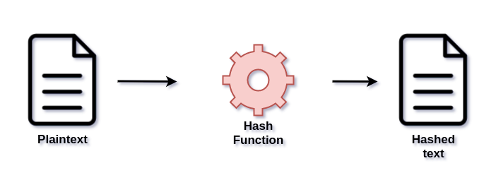

<!--  -->

# Cybersecurity

<!-- TOC -->

- [Cybersecurity](#cybersecurity)
	- [Solid base and terminology](#solid-base-and-terminology)
		- [Terminology](#terminology)
	- [Authentication](#authentication)
		- [Password](#password)
			- [Hashing](#hashing)
		- [Tokens](#tokens)
		- [Biometric](#biometric)

<!-- /TOC -->

## Solid base and terminology

---

Cybersecurity is trying to achieve all of above goals for data and services:

- **Availability** - _You should be able to use your bank account_
- **Integrity** - _Your bully should not be able to change your name_
- **Accountability** - _Your bully should not be able to take credit for your work_
- **Confidentiality** - _Your friends should not be able to see your divorce papers_
- **Authenticity** - _You should be able to get the real amount of money stored in your PayPal_

There are two base types of attacks.

- **Passive attack** - _Attacker just gets some information without harming system resources (Really hard to detect)_
- **Active attack** - _Attacker does something to the system resources (Easier to detect)_

There's another way of separating attacks into two categories;

- **Internal attack** _Attacker is an imposter_
- **External attack** _Attacker is not from the company/system_

### Terminology

- **Threat** - Any circumstance or event with the potential of impacting system in a bad way

- **Advanced Persistent Threat (APT)** - Cyber crime focused at one company/group for a longer periods of time

- **Vulnerability** - A hole in security

- **Security flaw** - Implementation defect that can lead to a vulnerability now or in the future

- **Exploit** - Code that takes advantage of software Vulnerability

- **Malware** - Program inserted to a system with malicious intent

- **Virus** - Software which is trying to infect another machines or programs when executed by the attacked host

- **Worm** - Stand-alone self-replicating program. With intentions to spread

- **Backdoor/Trapdoor** - Covert method of bypassing authentication

- **Spyware** - Type of malware that gathers information

- **Adware** - Type of malware that makes ads pop up or redirect websites to ads with a browser

- **Ransomware** - Type of malware that threatens to post publicly or blocks access to victim's data unless paid

- **Trojan horse** - Computer program disguised as legitimate software but hiding a potentially harmful function

- **Rootkit** - Set of tools that enable an unauthorized user to get administrator privileges

- **Logic Bomb** - Set of instructions secretly incorporated into a program so that if a particular condition is satisfied they'll start doing (usually harmful) stuff

- **DoS** - Denial of Service attack

- **DDoS** - Distributed denial of Service attack

- **Flooders** - Tools used to generate big amounts of data to achieve denial of service

- **Keyloggers** - Type of malware that records keystrokes to gain access to passwords and other valuable information

- **Zombie** - Compromised computer by the hacker with intentions to use it in a malicious way

- **Spammer programs** - Programs that sends lots of unwanted content through different social platforms

- **Brute force** - A method of trying all the possibilities until the solution to a problem is found

- **Spoofing** - Impersonating another host

## Authentication

There are four main types of authentication.

1. Password type - It's just some sort of a data known only to a desired person.
2. Entry card type - It's something that a person can have (For example Yubikey).
3. Fingerprint type - Some biological identification of a person
4. Voice recognition type - It's something that only one person can do

Basically you can use those things to check if you're actually giving the right person some important data.
When you're using one of them it's called single-factor authentication and if you're using more than one, it's multi-factor authentication.

### Password

Password-type authentication is pretty good but have some problems (Like any other). It's still mostly picked option tho.

Those are the main attacks that it might be vulnerable to:

- **Popular passwords attack**
  - An attacker can just find some online list of commonly used passwords and try every single one of them. The most simple way of preventing this types of attacks is to use randomly generated passwords.
- **Brute-force attack**
  - An attacker can try every single password combination. It's possible because of power of modern computers. There's also a simple way of preventing it. You can just limit the number of password requests (For example: 10 unsuccessful for a day).
- **Personalized brute-force attack**
  - It's similar to bruteforce but an attacker instead of generating random junk tries to generate personalized password
    (For example: knowing that the favorite series of a victim is "Friends" attacker can force the algorithm to include the word "Friends" in those combinations
    / Or knowing that in victim's company passwords have to have from 6 to 8 letters and have to include some special characters in them.
    Attacker can improve his brute-force algorithm for that specific person) To fix that you can enforce people to use different sizes and different types of passwords.
- **Dictionary attack**
  - After stealing a file with password hashes an attacker can try to get the password
    by comparing hashes of lots of different passwords from a password dictionary to it's hash.
- **Multiple-use attack**
  - Lot's of people use the same password on a lot of different sites. It's not really good because after a leak of passwords of one site, an attacker can just try those leaked passwords and might succeed to log in.
    Attacker can also get people to register on his site to get their passwords and to try to use them anywhere else.
- **Capturing attack**
  - When the password is being sent while unencrypted through some public wifi (some http sites still do that) it might get caught by someone monitoring the traffic. The main solution is to encrypt those passwords
- **Physical attack**
  - Someone can just steal your unlocked laptop when you're somewhere else.
    The simplest way to fix this problem is to have some auto-locking thing on your laptop that turns on after a bit of inactivity.
- **Human attack**
  - Almost all of the above could be here but I'd like to write about another problem.
    Some people share passwords. Another people write their passwords on the fridge.
    It's like asking for trouble. I'd recommend to try to not let anyone see your passwords.

#### Hashing

Because hashing is irreversible you can use it to store passwords on a device.
When someone would be able to get those password file he might be surprised that there's no possibility of getting passwords out of it.

Hashing basically looks like this:

There's no possibility of getting plaintext from hashed text.
The only thing you can do is comparing hashes. If they match then you can guess what was the plaintext.

That seems like a bit of a problem.

It's a problem because if the attacker sees that some person has the same hash of password as another person, he can try to get password of this second person and this might reveal password of the first one.

That's when **Salting** comes in. salt is just a bit of random bits added to password when hashed. That way it changes this hash to be different.

### Tokens

Instead of having to remember quite a lot of long passwords you can use some sort of a device to grant access to your data.

That sounds really promising but just like with passwords it has both pros and cons.

When it comes to memory cards there are several cons:
1. Possibility of loosing it. _Attacker could easily grant access with that_
2. In some cases worse accessibility.
3. Having a reader could lead to other vulnerabilities and increase costs.

### Biometric

Using parts of your body to authenticate might sound scary, but it's actually not that bad of a idea. Actually, most modern phones can be unlocked either with your face or with your fingerprint.

To the most commonly used _physical features of a person_ for authentication there are these:

1. Face
2. Fingerprints
5. Voice
3. Hand measures
4. Eye retina pattern

The most accurate would be eye retina pattern, but it's also one of the most expensive ones.

When you're implementing this type of authentication in your product you have to think about stuff like _false match rate_ and _false no match rate_ It's basically how accurate your system is and how many false-positives/false-negatives there would be.

<!--  -->
