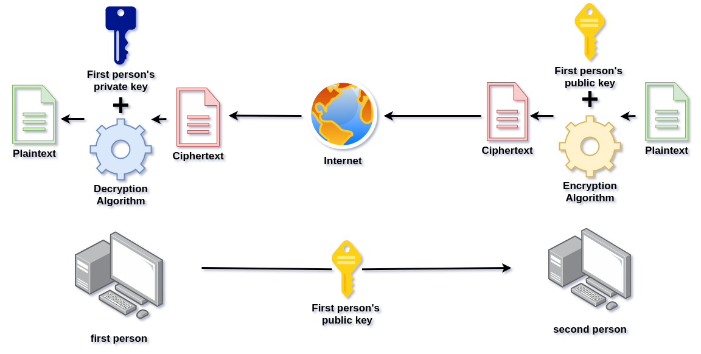

<!--  -->

# Cybersecurity

<!-- TOC -->

- [Cybersecurity](#cybersecurity)
	- [Solid base and terminology](#solid-base-and-terminology)
		- [Terminology](#terminology)
	- [Cryptography](#cryptography)
		- [Symmetric encryption](#symmetric-encryption)
			- [One-time pad cryptography](#one-time-pad-cryptography)
			- [Cryptoanalysis](#cryptoanalysis)
			- [Bruteforce](#bruteforce)
			- [Frequency analysis](#frequency-analysis)
			- [Block cipher](#block-cipher)
		- [Asymmetric encryption](#asymmetric-encryption)
			- [RSA](#rsa)
		- [Authentication](#authentication)

<!-- /TOC -->

## Solid base and terminology
---

Cybersecurity is trying to achieve all of above goals for data and services:

* Availability - _You should be able to use your bank account_
* Integrity - _Your bully should not be able to change your name_
* Accountability - _Your bully should not be able to take credit for your work_
* Confidentiality - _Your friends should not be able to see your divorce papers_
* Authenticity - _You should be able to get the real amount of money stored in your PayPal_
    

There are two base types of attacks.

* Passive attack _Attacker just gets some information without harming system resources (Really hard to detect)_ 
* Active attack _Attacker does something to the system resources (Easier to detect)_
    

There's another way of separating attacks into two categories;

* Internal attack _Attacker is an imposter_
* External attack _Attacker is not from the company/system_
    

### Terminology

| Name | Description |
| --- | --- |
| Threat | Any circumstance or event with the potential of impacting system in a bad way |
| Advanced Persistent Threat (APT) | Cyber crime focused at one company/group for a longer periods of time |
| Vulnerability | A hole in security |
| Security flaw | Implementation defect that can lead to a vulnerability now or in the future |
| Exploit | Code that takes advantage of software Vulnerability |
| Malware | Program inserted to a system with malicious intent |
| Virus | Software which is trying to infect another machines or programs when executed by the attacked host |
| Worm | Stand-alone self-replicating program. With intentions to spread |
| Backdoor/Trapdoor | Covert method of bypassing authentication |
| Spyware | Type of malware that gathers information |
| Adware | Type of malware that makes ads pop up or redirect websites to ads with a browser |
| Ransomware | Type of malware that threatens to post publicly or blocks access to victim's data unless paid |
| Trojan horse | Computer program disguised as legitimate software but hiding a potentially harmful function |
| Rootkit | Set of tools that enable an unauthorized user to get administrator privileges |
| Logic Bomb | Set of instructions secretly incorporated into a program so that if a particular condition is satisfied they'll start doing (usually harmful) stuff |
| DoS | Denial of Service attack |
| DDoS | Distributed denial of Service attack |
| Flooders | Tools used to generate big amounts of data to achieve denial of service |
| Keyloggers | Type of malware that records keystrokes to gain access to passwords and other valuable information |
| Zombie | Compromised computer by the hacker with intentions to use it in a malicious way |
| Spammer programs | Programs that sends lots of unwanted content through different social platforms |
| Brute force | A method of trying all the possibilities until the solution to a problem is found |
| Spoofing | Impersonating another host |

## Cryptography
---

### Symmetric encryption

In this type of encryption you only have one key. It's used both for encryption and decryption

It basically looks like this.

1. Plaintext goes through a encryption algorithm that uses a secret key to encrypt it resulting in creation of ciphertext.
2. You can pass this ciphertext to your friend who has a copy of this secret key and knows what type of algorithm you used.
3. He decrypts it by using this key and decryption algorithm (Typically reversed encryption algorithm).


Example:

> Data
- Message - 'I need money'
- Key - '32345112324324324'
- Encryption algorithm - Add to char values the ones from a key. 
- Decryption algorithm - Subtract from char values the ones from a key. 
> Steps
1. `I need money` -> Encryption algorithm + Key -> `L"qije!orpi|`
    - `I` -> 73 + 3 -> `L`
    - `n` -> 110 + 2 -> `q`
    - `e` -> 101 + 3 -> `i`
    - `e` -> 101 + 4 -> `j`
    
2. You give this `L"qije!orpi|` ciphertext to your friend

3. `L"qije!orpi|` -> Decryption algorithm + Key -> `I need money`

C++ implementation of this simple encrypting algorithm:
```cpp
string key = "32345112324324324";
string msg = "I need money";
int index = 0;
for(auto &x : msg)
{
    x += (int)(key[index] - '0'); //+= for encrypting -= for decrypting
    index++;
}
cout << msg << "\n";
```

There are some problems related to this type of security.

1. You need to use a strong encryption algorithm. 
2. You need to somehow give the key to your friend without making the possibility for anyone else to see it. 
3. You need to store the key safely.

#### One-time pad cryptography

The main idea behind it is to for every bit of plaintext have a bit of key.

This is the most safe type of cryptography!
But sadly it does have some flaws.

- If you wanted to encrypt your 1tb of data then you'd need 1tb key. _Imagine having to double your storage just to be able to store your key._

- You need to somehow safely send and store the key.

- Even if you manage to store your key securely

#### Cryptoanalysis

You can perform cryptoanalysis knowing 
- Only ciphertext 
- Some plaintext
- Parts of the key
- Key
- Parts of the algorithm

One of parts of Cryptoanalysis is   

#### Bruteforce

Let's consider this situation:
We know how the algorithm work. We just do not know the key.
You can write a script that can generate all kinds of keys and tries to decrypt ciphertext while using them. 

#### Frequency analysis

This type of analysis can be applied to old encryption algorithms, where each letter has it's corresponding letter. For example ROT 13 cipher.
In this cipher you should add `13` to all char values of the letters. _If any goes out of range, then you should add the leftover to the first char value._ 

This is how it works.

Let's consider this text as a simple ciphertext:

<!-- cSpell:disable -->
```txt
Ny xyd eco sd sp iye gkxd dy qod qyyn li boknsxq sd! S kw zboddi cebo drkd cusvv mywoc wycdvi gsdr zbkmdsmo. Drsc xydo wkusxq zbymocc gkc wi gki yp zbkmdsmo :). Drsc sc xyd k zvkmo grobo loqsxxob mynobc vokbx sd'c tecd k myvvomdsyx yp wi xydoc. S'w xyd k zbypoccsyxkv gbsdob xyb k dokmrob xyb xkdsfo oxqvscr czokuob, cy cy sd wsqrd myxdksx cywo pkvco sxpybwkdsyx, lkn mynsxq zbkmdsmo kxn oxqvscr qbkwwkb scceoc. Drsc sc k nsqsdkv fobcsyx yp wi xydoc. S'fo wkno drow lkcon yx k lsd yp lyyuc, kbdsmvoc kxn fsnoyc. Ofobi csxqvo gybn sx robo sc gbsddox li wo. S econ RDWV kxn cywo MCC dy wkuo sd cyworyg boknklvo. (S'w xyd k qbkzrsm nocsqxob xyb k pbyxd oxn nofovyzob cy zvokco nyx'd tenqo wo). S'w nysxq sd dy lo klvo dy rkfo k cyvsn myzi yp wi vokbxsxq wsxncod pyb grox S'w xyd qyxxk lo klvo dy bowowlob cywodrsxq pbyw robo. (Kvcy S rkn cywo sxdobxod scceoc kxn rkn kmmocc yxvi dy cywo zbyqbkwwsxq lyyuc kxn qyd k lsd lybon) Pyb xyg iye mkx'd bokvvi myxdbsledo dy drsc led sp iye gkxd dy zysxd yed cywo wscczovvsxq/qbkwwkb scceoc poov pboo dy myxdkmd wo.
```
<!-- cSpell:enable -->
This is a simple table of three letter frequency (Not all the letters bc I'm lazy):

| Letter    | Frequency |
| --------- | --------- |
| E | 12.60 % |
| T | 9.37 % |
| A | 8.34 % |

And this is the frequency for letters in this ciphertext (Didn't include all bc it'd be really long):

| Letter | Frequency|
| --- | ------ |
| O | 8% |
| Y | 7% |
| D | 6% |

We can now try to mach those. (Of course the longer ciphertext is the more accurate it would be). Remember that sometimes you might need to mix up a bit (Like switch two letters) because not all sentences are 100% accurate with english frequency

#### Block cipher

It encrypts plaintext in blocks with constant size. It produces ciphertext blocks with the same size as plaintext blocks

DES might be the most tested block algorithm ever, because a lot of people wanted to prove that the algorithm might not be proof to cryptoanalysis. 
Sadly they weren't able to find any critical vulnerabilities of this standard.

A bigger problem of DES might be de length of encryption key. In case of 56 bit key there are possible `2^56 = 72057594037927936` keys. It is not a lot considering the fact that modern multi threaded processors can check 10<sup>9</sup> combinations per second. 


| Name | Block size _(bits)_ | Key size _(bits)_ | Time needed to break (10<sup>9</sup> tries/s) |
| --- | --- | --- | --- |
| DES | 64 | 56 | 1,125 year | 
| AES | 128 | 128 | 5,3*10<sup>21</sup> years |
| AES | 128 | 192 | 9,8*10<sup>40</sup> years |
| AES | 128 | 256 | 1,8*10<sup>60</sup> years |

AES kinda rulez huh?

There is also a thing called 3DES and that's a desperate way of trying not to let this old guy die.
If I'm understanding that correctly these guys made it possible to just do a triple DES with different keys.

But what if you have more data than a 64 bit block.
That's when the most common method of doing it comes in.
 
**ECB** - _Electronic codebook_ - You split your data into *n* *  (64 or 128 bit blocks) and you encrypt it with the same algorithm and with the same key.

To avoid cryptoanalysis weaknesses there is a thing called _modes of operation_
I'll get to that later.

### Asymmetric encryption

Asymmetric cryptography is also known as public-key cryptography.
It uses a pair of keys.

That's basically how it looks:



One of the misconceptions is that public-key cryptography is les vulnerable to cryptoanalysis. There's actually no proof behind that statement.

It's build out of a few things:

 - Public key - _used to encrypt_
 - Private key - _used to decrypt_
 - Plaintext - _Something we want to encrypt_
 - Ciphertext - _Something we want to encrypt_
 - Encryption Algorithm - _Algorithm to encrypt stuff using public key_
 - Decryption Algorithm - _Algorithm to decrypt stuff using private key_

And this is more confidentiality based.
There's also another way of doing it.


This second way puts more pressure on authenticity.

This is how it looks:


It's more about digital signing and proving the author of a specific content.
That way you can make sure that content is untouched by anyone.

#### RSA

In RSA the keys are generated in this simple way.

1.  You choose two different primes. **p and q**
    _They should be kept secret (obviously)_

2. You compute a multiplication of those. **n = pq**
    _It'll be used as a modulus for both public and private keys and it's gonna be a part of public key._

3. Calculate **λ(n)** where n is this multiplication of primes. **λ(n)** is Carmichael's function.  I've covered that in my Math notes. There is a shortcut for counting that tho. Because we're talking about primes you can speed process up by instead of counting lambda of n you can do Least common multiple of λ(first_prime) and λ(second_prime). And because they're primes _(λ(prime) = prime - 1)_  you can do: λ(n) = lcm(first_prime - 1, second_prime -1); And you can count lcm through euclidean algorithm.

4. Chose an integer **e** so that **λ(n)** and **e** are coprime and **1 < e < λ(n)**
The easiest pick would be 3 but it might be less secure. That's why **2<sup>16</sup> + 1** is the most commonly picked option.
**e** is a part of a public key.

5. Calculate **d &Congruent; e<sup>-1</sup>(mod λ(n))** 
*d is the modular multiplicative inverse of e modulo λ(n)*
 
Let's try to go over it:

1. We're picking two primes
	- p = **6469**
	- q = **7877**
2. We're computing n:
	- n = 6469*7877 = **50956313**
3. We're computing λ(n):
	- λ(n) = lcm(6469-1, 7877-1) = **1157772**
4. We're choosing e:
	- e = 2<sup>16</sup> + 1 = **65537**
5. We're calculating d: 
	1. d*e ≡ 1 (mod λ(n))
	2. d*65537 ≡ 1 (mod 1157772)
	3. d = 7985

To encrypt `m` we need to calculate 

c(m) = m<sup>e</sup> mod n

To decrypt `c` we need to calculate

m(c) = m<sup>d</sup> mod n

So we have:

1. Private key (d = 7985, n = 50956313)
2. Public key (e = 65537, n = 50956313)

Let's go over an encryption/decryption process of `3` with our private and public keys.

Encryption: 
1. c(333) = 3<sup>65537</sup> mod 50956313
2. c(333) = 28544997

Decryption:
1. m(c) = 28544997<sup>7985</sup> mod 50956313
2. m(c) = 3

### Authentication

Authentication in general has a lot of pluses and a bit of minuses.
It takes care of accountability, confidentiality and integrity. The minus might be that it makes it harder to access your data.


<!--  -->


