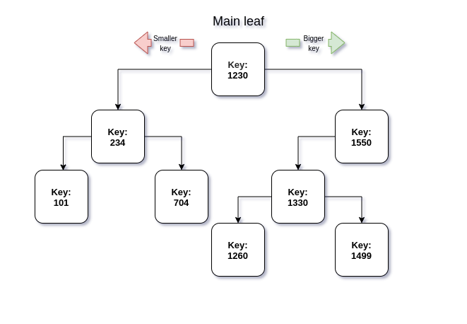

<!--  -->

# Data structures
<!-- TOC -->

- [Data structures](#data-structures)
	- [What even is data structure?](#what-even-is-data-structure)
	- [Stack](#stack)
	- [Queue](#queue)
	- [Matrix](#matrix)
		- [Multiplying each element](#multiplying-each-element)
		- [Adding two matrices](#adding-two-matrices)
		- [Rotating](#rotating)
	- [Binary tree](#binary-tree)

<!-- /TOC -->

## What even is data structure?
---

Data structure is a way of organizing the data so that it can be used efficiently.

## Stack
---

Stack follows the FILO/LIFO order.

 - FILO - First in, last out.
 - LIFO - Last in, first out. 

This is a simple diagram of a stack.


You can see, that the first element inserted there will be the last out.
This is my simple and not secure implementation of a stack in C++:
```cpp
template <class T>
class RlenStack{
    int size = 0;
    int max_size = 0;
    T *arr = NULL;
public:
    RlenStack(int max_size){ this->arr = new T[max_size]; this->max_size = max_size;} //allocate memory
    void push(T element){if(size<max_size-1) this->size++; arr[size-1] = element; } //add to array
    void pop(){if(size)this->size--;} //decrease size
    T top(){ if(size)return arr[size-1]; } //get the top element from array
    int get_size(){ return size; } //return size
    ~RlenStack(){ delete []arr; } //free memory
};
```
Possible usage:
```cpp
RlenStack<int> s(100); //declaration where 100 is the max amount of elements stored
s.push(4); //adding element
s.pop(); //removing element
int x = s.top(); //getting top element
```

After some improvements suggested by w1ndex this is my second implementation
```cpp
template <class T>
class RlenStack{
    int size = 0;
    int max_size = 2;
    T *arr = NULL;
public:
    RlenStack(){this->arr = new T[2];} //allocate memory
    void push(T element)
    {
        if(size<max_size-1) 
        {
            this->size++; 
            arr[size-1] = element;
        }
        else //reallocation of the main array 
        {
            max_size *=2; 
            T *new_arr = new T[max_size];
            for(int i = 0; i < size; i++) 
                new_arr[i] = arr[i];
            delete []arr;
            arr = new_arr;
            new_arr = NULL;
        }
    }
    void pop(){if(size)this->size--;} //decrease size
    T top(){ if(size)return arr[size-1]; } //get the top element from array
    int get_size(){ return size; } //return size
    ~RlenStack(){ delete []arr; } //free memory
};
```
and the usage might be:
```cpp
int main()
{
	RlenStack<int> *r = new RlenStack<int>;
	r->push(4);
	delete r;
}
```

## Queue

Queue follows the FIFO order (first in first out).

This is a simple diagram of a queue.


So um, I'm just gonna implement that in c++.
```cpp
template <class T>
class RlenQueue{
    int back_i = 0;
    int front_i = 0;
    int max_size = 0;
    T *arr = NULL;
public:
    RlenQueue(int max_size){ this->arr = new T[max_size]; this->max_size = max_size;} 
    void push(T element){arr[front_i] = element; if(front_i < max_size-1)front_i++; else front_i = 0;}
    void pop(){if(back_i<max_size-1)back_i++;else back_i = 0;}
    T front(){return arr[back_i];}
    int get_size(){ return back_i < front_i ? front_i - back_i : max_size-1-back_i+front_i; }
    ~RlenQueue(){ delete []arr; }
};
```
This driver code:
```cpp
int main()
{
	RlenQueue<int>q(10);
	for(int i = 1; i <= 6; i++)
		q.push(i);
	std::cout << q.front() << "\n";
	q.pop();
	std::cout << q.front() << "\n";
	q.push(2);
}
```
would output:
```sh
1
2
```
So it works :D

## Matrix

Matrix is a rectangular array of numbers.
Those are some examples of matrix.


### Multiplying each element

Let's consider this matrix `int t[3][4]`:
```
[1][1][2][3]
[6][5][4][3]
[7][8][9][9]
```
If we wanted to multiply all the elements by `6` we would have to do this:
```cpp
for(int i = 0; i < 3; i ++) //there are three rows
    for(int j = 0; j < 4; j++) //4 elements each
        t[i][j] = t[i][j]*6;
```

### Adding two matrices

Let's consider this two matrices `int t[3][4]` and `int w[3][4]`:
```
[1][1][2][3]
[6][5][4][3]
[7][8][9][9]

[7][8][9][9]
[1][1][2][3]
[6][5][4][3]
```
What if we wanted to add `w` to `t` and store the sum in `int c[3][4]`.

It would look like this:
```cpp
for(int i = 0; i < 3; i ++) //there are three rows
    for(int j = 0; j < 4; j++) //4 elements each
        c[i][j] = w[i][j] + t[i][j];
```

### Rotating

You spin me right round! round round! Like a rocket baby right round! round round! 

We want to make this `matrix[3][4]`:
```
[7][8][9][9]
[1][1][2][3]
[6][5][4][3]
```
Look like this:
```
[9][3][3]
[9][2][4]
[8][1][5]
[7][1][6]
```
The algorithm for that is easy.

This is my simple implementation of it
```cpp
int matrix[3][4] = {{7,8,9,9},{1,1,2,3},{6,5,4,3}}; //previous matrix

int new_matrix[4][3]; //rotated matrix

for(int j = 3; j >= 0; j--) //go through all the columns from right to left
    for(int i = 0; i < 3; i++) //from top to bottom
    {
        new_matrix[3-j][i] = matrix[i][j]; 
    }

//printing out the array
for(int i = 0; i < 4; i++)
{
	std::cout << "\n";
	for(int j = 0; j < 3; j++)
	{
		std::cout << new_matrix[i][j] << " ";
	}
}
```
The output should be:
```
9 3 3 
9 2 4 
8 1 5 
7 1 6
```
And that's right :).

## Binary tree

This is what a binary tree looks like:



To implement it in C++ we would have to first define a structure.

```cpp
struct rlen_node
{
    int key;
    rlen_node *left;
    rlen_node *right;
};
```
It contains only an integer **key** variable and two pointers.

Those two pointers are there to point to newly added leaves (Or to NULL if there's nothing).

Now we can implement functions to add and delete leaves.

```cpp
void delete_tree(rlen_node *leaf)
{
    if (leaf != NULL)
    {
        delete_tree(leaf->left); // recursion to get rid of all the leaves on the left
        delete_tree(leaf->right);  // on the right too
        delete leaf;
    }
}

void add_node(int key, rlen_node *leaf)
{
    if (key < leaf->key) // if smaller go to the left
    {
        if (leaf->left == NULL)
        {
            leaf->left = new rlen_node;
            leaf->left->key = key;
            leaf->left->left = NULL;
            leaf->left->right = NULL;
        }
        else
            add_node(key, leaf->left);
    }
    else // otherwise to the right
    {
        if (leaf->right == NULL)
        {
            leaf->right = new Rlen_node;
            leaf->right->key = key;
            leaf->right->left = NULL;
            leaf->right->right = NULL;
        }
        else
            add_node(key, leaf->right);
    }
}
```

<!--  -->
