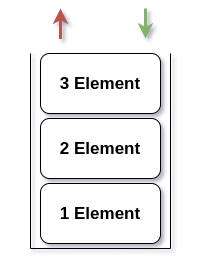

# Data structures
<!-- TOC -->

- [Data structures](#data-structures)
    - [What even is data structure?](#what-even-is-data-structure)
    - [Stack](#stack)

<!-- /TOC -->

## What even is data structure?
---

Data structure is a way of organizing the data so that it can be used efficiently.

## Stack
---

Stack follows the FILO/LIFO order.

 - FILO - First in, last out.
 - LIFO - Last in, first out. 

This is a simple diagram of a stack.



You can see, that the first element inserted there will be the last out.
This is my simple and unsecure implementation of a stack in C++:
```cpp
template <class T>
class RlenStack{
    int size = 0;
    T *arr = NULL;
public:
    RlenStack(int max_size){ this->arr = new T[max_size]; } //allocate memory
    void push(T element){ this->size++; arr[size-1] = element; } //add to array
    void pop(){ this->size--; } //decrease size
    T top(){ return arr[size-1]; } //get the top element from array
    int get_size(){ return size; } //return size
    ~RlenStack(){ delete []arr; } //free memory
};
```
Possible usage:
```cpp
RlenStack<int> s(100); //declaration where 100 is the max amount of elements stored
s.push(4); //adding element
s.pop(); //removing element
int x = s.top(); //getting top element
```


