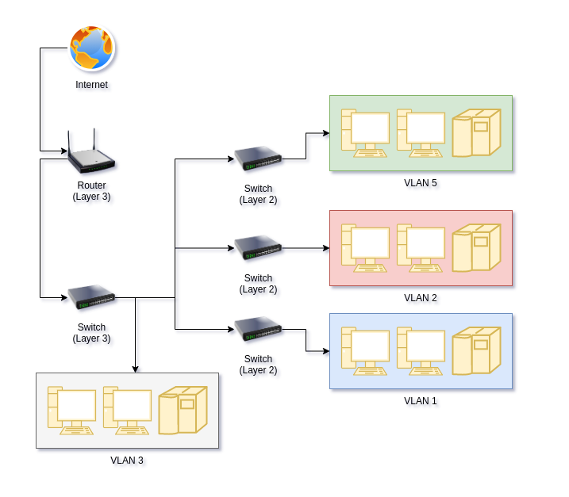

# Networking and stuff

<!-- TOC -->

- [Networking and stuff](#networking-and-stuff)
	- [World Wide Web](#world-wide-web)
		- [HTTP](#http)
			- [Requests](#requests)
			- [Curl](#curl)
			- [HTTPS](#https)
		- [HTML](#html)
		- [URL](#url)
	- [IETF](#ietf)
		- [Robots exclusion standard](#robots-exclusion-standard)
	- [OSI model](#osi-model)
		- [Physical Layer](#physical-layer)
		- [Data Link Layer](#data-link-layer)
		- [Network Layer](#network-layer)
		- [Transport Layer](#transport-layer)
		- [Session Layer](#session-layer)
		- [Presentation Layer](#presentation-layer)
		- [Application Layer](#application-layer)

<!-- /TOC -->

## World Wide Web

---

The web is not internet. Internet is a network of connected computers. World wide web is a system of public webpages accessible **through** the internet.

It has these three technologies:

### HTTP

(Hypertext Transfer Protocol) It's a network protocol for transferring hypermedia documents over the web.

#### Requests

When you want to access some data through a server you make a HTTP request.
It's similar to just saying `Hey! Can you please send me this pdf document?` to your friend.

Your browser makes a request every time you visit any webpage.

Example request:

```
GET / HTTP/1.1
Host: example.com
Accept-Language: pl

```

Correct HTTP request contains:

- Request line
- HTTP headers
- Body message

You can make request through a browser but you can also use other tools.
One of my favorite tools is Curl.

#### Curl

Curl is a command line tool and library. It's used for transferring data with URL's.

I'm mostly using its command line interface.

This is the example of using curl to make a `GET` request for `http://example.com/`

```sh
curl -GET  http://example.com/
```

This will print out this:

```txt
<!doctype html><html><head> <title>Example Domain</title> <meta charset="utf-8"/> <meta http-equiv="Content-type" content="text/html; charset=utf-8"/> <meta name="viewport" content="width=device-width, initial-scale=1"/> <style type="text/css"> body{background-color: #f0f0f2; margin: 0; padding: 0; font-family: -apple-system, system-ui, BlinkMacSystemFont, "Segoe UI", "Open Sans", "Helvetica Neue", Helvetica, Arial, sans-serif;}div{width: 600px; margin: 5em auto; padding: 2em; background-color: #fdfdff; border-radius: 0.5em; box-shadow: 2px 3px 7px 2px rgba(0,0,0,0.02);}a:link, a:visited{color: #38488f; text-decoration: none;}@media (max-width: 700px){div{margin: 0 auto; width: auto;}}</style> </head><body><div> <h1>Example Domain</h1> <p>This domain is for use in illustrative examples in documents. You may use this domain in literature without prior coordination or asking for permission.</p><p><a href="https://www.iana.org/domains/example">More information...</a></p></div></body></html>
```

We can specify request headers with this tool.
For example:

```sh
curl -GET  http://example.com/ -H "User-Agent: My_Browser_lol"
```

And it'll say that this request was made by `My_Browser_lol`.
Pretty useful when trying to let's say bypass a blockade for users from specific browser.

You can also use `X-Forwarded-For` to bypass some sort of authentication related to only allowing local addresses to access the page.

```sh
curl -GET  http://example.com/ -H "X-Forwarded-For: 192.168.1.20"
```

It specifies the address which the request is made by.

#### HTTPS

Https is an encrypted version of http. So if anyone in the caffee will try to steal your passwords by looking at what is going through the router then he cannot get those information because it's encrypted.

So when you visit `https://www.google.com/` this `https` is saying that your browser expects encrypted data and it demands it.

### HTML

(Hypertext Markup Language) This is a markup language that is interpreted by the browser in a way that you do not need to read any code but you can see pretty pages.

This is a simple example of html:

```html
<h1>This is a big header</h1>
<div>This is some content in a div</div>
```

Browser will get rid of those `<h1>` and `<div>` tags and display it in a specified way (for example: text in this header tags will be bigger and most likely bolder).

### URL

(uniform resource location)

## IETF

Internet Engineering Task Force is an organization that creates Internet standards. You do not have to use them but yeah, it's there.

### Robots exclusion standard

Proposed to add to IETF by google.

It basically comes down to creating a simple robots.txt file to specify which directories and which files are search engines/crawlers/other web robots allowed to use.

This is how it might look `https://www.example.com/robots.txt` in the url.
And this is how this file might contain:

```
Allow: /some/directory
Disallow: another/directory
```

## OSI model

Open Systems Interconnection model is just a way to describe Network Architecture.
It has 7 layers.

Higher number means more abstract layer. _in my opinion of course_

### 1. Physical Layer

Basically responsible for transmitting data through some sort of a physical medium.
Most likely cables.

So if some engineer says something along the lines of "There's a problem on the first layer"
You might expect some problems with cables etc.

### 2. Data Link Layer

You can think of this layer when you hear _Switch, Ethernet, Bridge_. They transform the data to the physical layer.
This handles errors correction from the first layer. 

### 3. Network Layer

It's based on the IP protocol. In this layer all the data segments have specified source and destination address.
Switches can also be on this layer in contrast to second-level switches (second level switches manage traffic within a LAN) 
and this third layer switch manages traffic between local networks.

This diagram that I made shows what I'm trying to say:


### 4. Transport Layer

When you hear _UDP_ or _TCP_ then you know it's fourth layer's fault. 
Those are the two protocols responsible for transporting data. TCP is connection-oriented protocol (That makes it so that data is transmitted in ordered lossless way) and UDP is connectionless (That gives it more speed).

TCP is mostly used when data loss is very bad for the customer.
UDP is mostly used when speed is needed. 

### 5. Session Layer

You can associate it with NFS and RPC. Basically when you open `google.com` your PC starts a session with google's server. This session terminates when you leave this website/log out of it/close your browser. To successfully start a session you need to have IP address, know IP address of the server and number and type of a port.  

### 6. Presentation Layer

It's some sort of a way of showing the user some data not necessarily the same as shown.
Good analogy would be HTML. As a programmer you're writing code that is later interpreted by a browser.
That way you can show someone a beautiful website even when he does not understand code.

_It's just a **Presentation** layer_

You can think of it when you hear _MP3, JPG, ASCII_


### 7. Application Layer

It can be a browser. It can be a mail client. It's just a layer for all the applications that are helping people interact with stuff.
